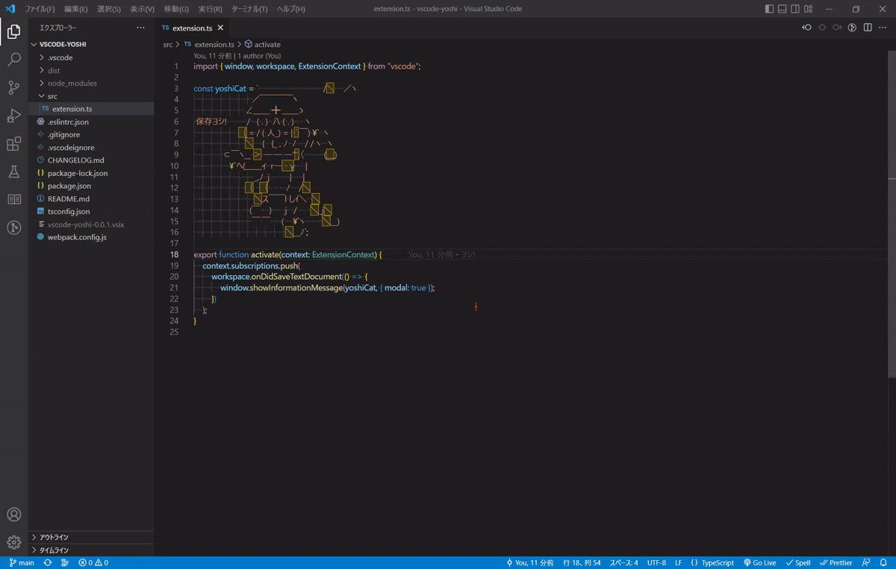

# vscode-yoshi
**何だか知らんがとにかくヨシ!**



### インストール ヨシ!
```
code --install-extension lapis256.vscode-yoshi
```

### ~~パク…~~ インスパイア ヨシ!
- Vim版
  - [ツイート](https://twitter.com/mattn_jp/status/1592728184755486722)
  - [ソース](https://github.com/mattn/vim-yoshi/)
- Emacs版
  - [ツイート](https://twitter.com/gongoZ/status/1592885021534457856)
  - [ソース](https://gist.github.com/gongo/33fe5bd8f89e48f3653a28946cee8cb1)
